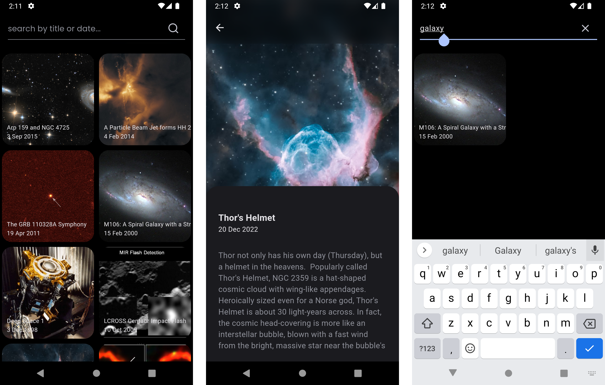
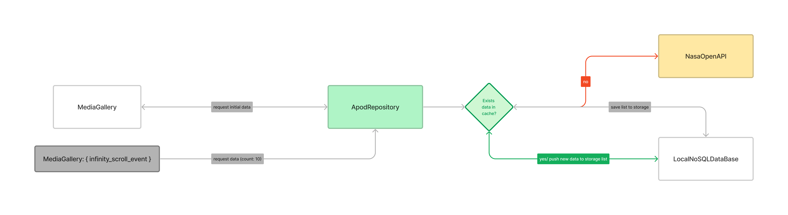
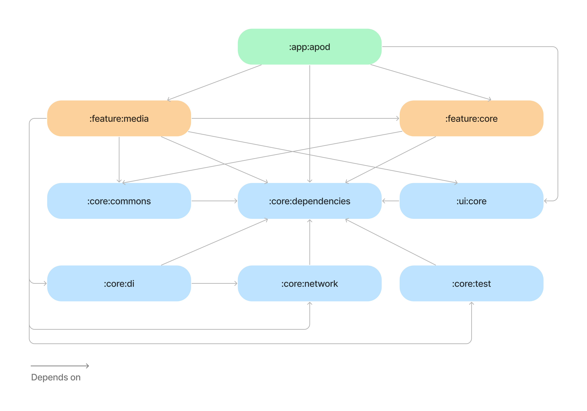

### @cloudwalk-mobile-test

This Apod application, provides a showcase of using NASA's APOD (Astronomic Picture of The Day) API for for show awesome pictures of the universe, made with Dart/Flutter 💙. Here you'll
find concepts such as Clean Architecture, Clean Code, SOLID and another things related to the best coding practices.

#

- **[Features and Architecture](#features-and-architecture)**
- **[Technical Resources](#technical-resources)**
- **[Getting Started](#getting-started)**

<br>



<br>
<br>

## Features and Architecture

The project has only one main feature called: `:feature_media`, that holds the business rule for retrieve media itens from Nasa's Open API and handle the results accordingly. You can find out more details in the next section.



## App Modularization Guide

This project uses a modularization approach with mono-repo, to organize
and breaking the concept of monolithic into loosely coupled, self contained
modules.



Here we have the following types of modules:

- The `app` module - is the main entry point for the app and contains some app level
  configuration.

- `feature` modules - contains specific modules which has a single responsibility
  and its follow Clean Architecture's approach.

- `core` modules - common library modules and specific dependencies that need to be
  shared between other modules in the app. These modules can be dependency of another core modules, but they shouldn’t depend on feature or app modules.

All these modules are managed by Melos CLI, with this tool, we have more control
over the dependencies in the entire project and we able to execute common tasks in all modules
at the same time -- [know more about Melos here](https://melos.invertase.dev/).
You can find, some scripts that is used by the project on `melos.yaml` file in the
root directory.

As a mentioned above, the project uses an mono-repo approach to organize all
the modules, this means that all the necessary modules exists inside this repository.
As you can see bellow:

```
.
├── apps
│   └── apod
│
├── packages
│  ├── core
│  ├── feature
│  └── ui
│
└── melos.yaml
```

<br>

# Technical Resources

- Usage of a simple state management with `Value Notifier`
- Clean architecture, SOLID and mono-repo concepts
- Usage of package `Result` for handling errors and success cases
- Lazy Loading for Infinity Scroll
- Offline storage with Shared Preferences (caching)
- Usage of Google Fonts (Poppins) for custom UIs
- CI workflow with GitHub Actions
- Melos CLI for management of mono-repo packages

<br>

# Getting Started

1. First you need to setup Flutter SDK. The project uses `FVM CLI` for manage flutter versions.

- Install FVM globally (macOs)

```shell
brew tap leoafarias/fvm
brew install fvm
```

- Install the the compatible version for this project, you can find in this directory `.fvm/fvm_config.json`

```shell
fvm install 3.19.3
```

- Set the installed version as global

```shell
fvm global 3.19.3
```

- Add the Flutter SDK path in your terminal config file `.zshrc` or `.bashrc`

```shell
export PATH=$PATH:~/fvm/default/bin
```

2. Clone this repository

```shell
git clone https://github.com/WillACosta/cloudwalk-mobile-test
```

3. Install `Melos CLI` as a global package with:

```shell
dart pub global activate melos
```

4. Use the following command to setup application

```shell
melos bootstrap
```

5. Go to the directory `apps/apod` and runs the following command, to get a copy for `.env` file, and fill it with your credentials.

```shell
cd apps/apod
cp .env.example .env
## open the file and add your API KEY (Get on https://api.nasa.gov/)
```

6. Now, you have to install Android and iOS SDK

- [iOS SDK/Xcode](https://developer.apple.com/xcode/)
- [Android SDK/Android Studio](https://developer.android.com/studio/install)

7. Open any available emulators and runs the application with

```shell
flutter run
```

## Running unit tests

1. Run all tests

```shell
melos test
```

You can find more scripts to execute in `melos.yaml` file.
